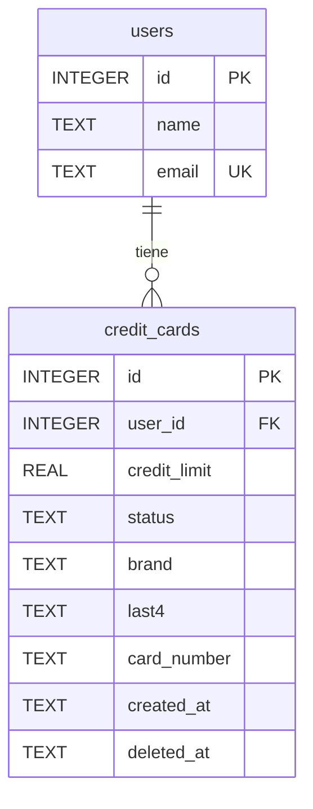

# API de tarjetas de crédito

Ejercicio de Node.js con Express, TypeScript en modo estricto y una base de datos relacional SQLite. Se escogió SQLite porque el profesor permite usar la base de datos de más fácil acceso. La captura menciona PostgreSQL; si ese requisito se mantiene como obligatorio, esta elección debe cambiarse.

## Ejecutar

Requiere Node.js 20 o superior y npm. Desde esta carpeta:

```powershell
npm install
npm run dev
```

La API escucha en `http://localhost:3000`. La primera ejecución crea `data/cards.sqlite` y un usuario de ejemplo con `id: 1`. Los cambios se guardan en ese archivo y se conservan al reiniciar. Para detener el servidor, pulsa Ctrl+C.

```powershell
npm run build
npm start
```

Para verificar el ejercicio:

```powershell
npm test
```

## Endpoints

| Método | Ruta | Resultado |
| --- | --- | --- |
| GET | `/api/v1/credit-cards` | 200, arreglo de tarjetas activas sin eliminar |
| POST | `/api/v1/credit-cards` | 201, crea una tarjeta; 400 si falta o es inválido userId, creditLimit o cardNumber |
| GET | `/api/v1/credit-cards/:id` | 200 o 404 si no existe o fue eliminada |
| PATCH | `/api/v1/credit-cards/:id` | 200, cambia creditLimit, status o ambos; 400 por datos inválidos |
| DELETE | `/api/v1/credit-cards/:id` | 204 sin cuerpo; eliminación lógica; 404 si no existe |

Los identificadores deben ser enteros positivos. `creditLimit` debe ser un número positivo. `status` permite `active` e `inactive`. POST asigna `active` automáticamente y exige un usuario existente. PATCH solo admite los dos campos indicados. Una tarjeta inactiva puede consultarse por id; una eliminada no puede consultarse ni reactivarse.

## Probar en PowerShell con curl.exe

Inicia el servidor en una terminal y ejecuta estos comandos en otra. Se utilizan archivos JSON para evitar problemas de comillas en Windows PowerShell. En una base nueva, la primera tarjeta tendrá id 1; sustituye ese id si la respuesta de POST indica otro.

```powershell
curl.exe -i http://localhost:3000/api/v1/credit-cards

'{"userId":1,"creditLimit":1500,"cardNumber":"4111111111111111"}' | Set-Content -Encoding ascii crear.json
curl.exe -i -X POST http://localhost:3000/api/v1/credit-cards -H "Content-Type: application/json" --data-binary "@crear.json"

curl.exe -i http://localhost:3000/api/v1/credit-cards/1

'{"creditLimit":2000,"status":"inactive"}' | Set-Content -Encoding ascii actualizar.json
curl.exe -i -X PATCH http://localhost:3000/api/v1/credit-cards/1 -H "Content-Type: application/json" --data-binary "@actualizar.json"

curl.exe -i -X DELETE http://localhost:3000/api/v1/credit-cards/1
curl.exe -i http://localhost:3000/api/v1/credit-cards/1
```

El último GET debe responder 404. Para comprobar el 400, envía POST con `{"userId":1}`. En Postman puedes usar las mismas URLs, método y cuerpos, seleccionando Body → raw → JSON.

## Modelo relacional



La clave foránea `user_id` conecta cada tarjeta con un usuario. DELETE conserva la fila y llena `deleted_at`, además de cambiar el estado a `inactive`. Las consultas excluyen filas eliminadas.

## Entender el código

- `src/server.ts`: inicia el servidor.
- `src/app.ts`: define rutas, valida datos y devuelve códigos HTTP.
- `src/database.ts`: crea tablas, inserta el usuario de ejemplo y guarda SQLite.
- `src/card-validation.ts`: comprueba el número e identifica la marca.
- `tests/api.test.ts`: verifica el CRUD, errores, filtros y que DELETE conserve la fila.

`sql.js` ejecuta SQLite en memoria y exporta el archivo después de cada escritura. Es una solución pequeña para este ejercicio, pensada para un solo proceso. El límite usa REAL por sencillez; una aplicación financiera real necesita una representación monetaria exacta y autenticación. Se almacenan la marca, los últimos cuatro dígitos y el número completo como texto sin espacios ni guiones. No se recibe CVV. Usa números de prueba en este ejercicio: el archivo guarda el número sin cifrar y la API lo devuelve completo.

## Validación del número

POST exige `cardNumber` como texto. Admite espacios y guiones, comprueba la marca, su longitud permitida y Luhn mediante [card-validator de Braintree](https://github.com/braintree/card-validator). UnionPay se valida por prefijo y longitud sin exigir Luhn, siguiendo el comportamiento de esa librería.

Las marcas reconocidas por la dependencia instalada son Visa, Mastercard, American Express, Discover, Diners Club, JCB, UnionPay, Maestro, Mir, Elo, Hiper, Hipercard, Verve, Naranja y Troy. No se garantiza cobertura de todas las redes del mundo; marcas desconocidas o ambiguas se rechazan con 400. Maestro y otras marcas pueden corresponder a tarjetas de débito: este ejercicio identifica la red, no el producto bancario.

El número `4111111111111111` del ejemplo es de prueba. Cambiar el último dígito a `2` debe devolver 400. Pasar esta comprobación no demuestra que una tarjeta exista, esté activa o tenga fondos.

GET, POST y PATCH devuelven `brand`, `last4` y `cardNumber`. PATCH continúa permitiendo únicamente `creditLimit` y `status`. Al abrir una base anterior se añaden las columnas sin borrar datos: las tarjetas existentes conservan sus valores y tendrán `cardNumber` en null si no se guardó su número completo.

## Guía para la exposición

1. Explica por qué elegiste Express y SQLite.
2. Crea una tarjeta y muestra la respuesta 201.
3. Consulta el arreglo y el detalle por id.
4. Cambia el límite y luego el estado; explica por qué una inactiva desaparece del listado.
5. Elimina la tarjeta y muestra el 204 y el posterior 404.
6. Explica la diferencia entre eliminar una fila y marcar `deleted_at`.
7. Muestra una validación 400 y la relación con el usuario de ejemplo.

Revisa y adapta el código antes de entregarlo. Si te preguntan por el uso de IA, describe con claridad qué ayuda recibiste y qué comprobaste personalmente.
